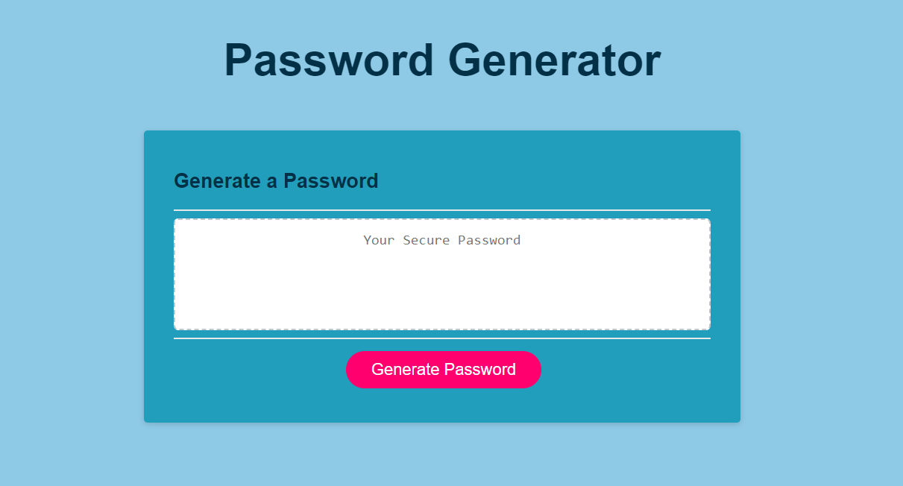

# Password Generator

## Table of Contents
- [Features](#features)
- [User Story](#user-story)
- [Installation](#installation)
- [Links](#links)
- [Technology Used](#technology-used)
- [Credits](#credits)
- [Permission](#permission)

## Features
### This application has the following features:
- A user can generate a password using specific parameters based on a prompt.
- They can choose length of password and what it includes (numeric characters, uppercase letters, lowercase letters and special characters).
- The app uns in the browser and features dynamically updated HTML and CSS, all powered by javascript. 
- The app has clean and polished user interface that is responsive and adapts to multiple screen sizes.

## User Story
As a user, I want to create a password generator so that an employee can generate a random password to their specification.

## Installation
- Open Git Bash
- Change the current working directory to the location where you want the cloned directory.
- Type git clone https://github.com/lissasimp/Weather-Dashboard.git
- You will see App running on port 3000! in the console. You can then view the app on http://localhost:3000/.

## Links
- Deployed Site: https://lissasimp.github.io/Password-Generator/

## Technology Used
- Javascript
- HTML
- CSS

## Credits
The following tutorials where used in this project:

- https://www.youtube.com/watch?v=JLZ4FH-L4eI
- https://www.youtube.com/watch?v=Pgdvj6InRKI&list=PLgBH1CvjOA62PBFIDq55-S6Beivje30A2&index=15
- https://www.youtube.com/watch?v=9hin-2yeCWY&list=PLgBH1CvjOA62PBFIDq55-S6Beivje30A2&index=15
- https://www.youtube.com/watch?v=_zYb4WB1eDo&list=PLgBH1CvjOA62PBFIDq55-S6Beivje30A2&index=17
- https://unitstep.net/blog/2009/08/11/evaluation-of-boolean-values-in-javascript/

## Permission
I'm happy for you to use the code or parts of the code for your own site, it is open source so people can learn from it and adapt it. However, I would encourage you to modify the theme and components to make it your own. If you are using the site's design largely unmodified, I'd appreciate being credited as the designer of the website.

I do not give permission to present any of my projects as your own.